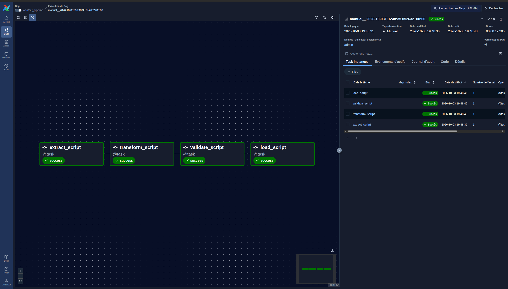
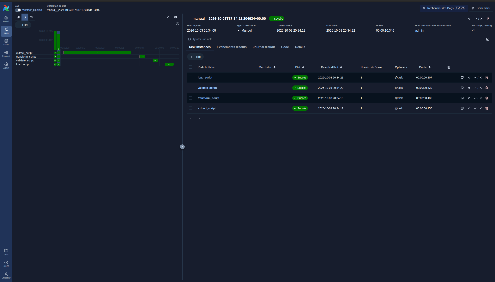
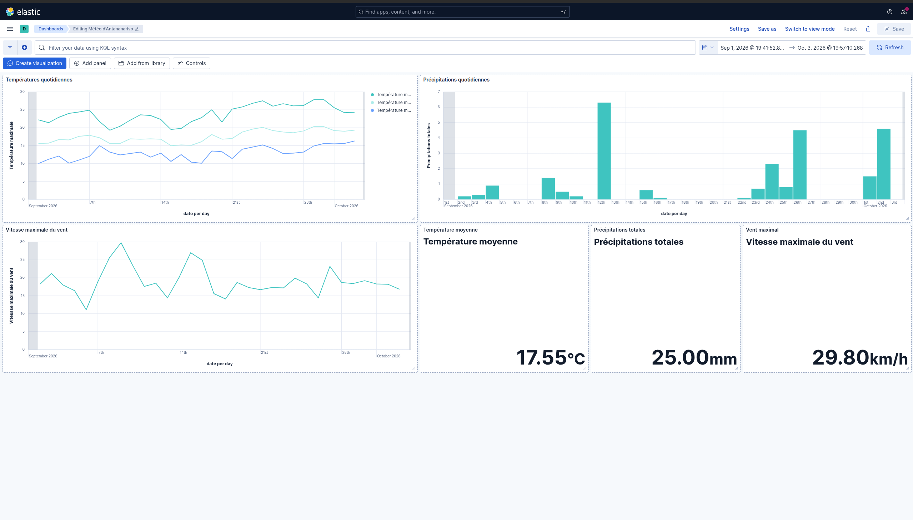

# Pipeline ETL météo avec Apache Airflow, Elasticsearch et Kibana

Projet de Data Engineering : collecte des données météorologiques d'Antananarivo, transformation et contrôle de leur qualité, stockage dans Elasticsearch, puis analyse et visualisation dans Kibana.

## 1. Objectif et contexte

Le pipeline suit le parcours suivant :

    API Open-Meteo → Airflow → Extract → Transform → Validate → Elasticsearch → Kibana

La source est l'API historique [Open-Meteo Archive API](https://archive-api.open-meteo.com/v1/archive). Le pipeline récupère les données quotidiennes pour Antananarivo, Madagascar :

- latitude : -18.8792 ;
- longitude : 47.5079 ;
- période configurée : du 2026-09-01 jusqu'à la date d'exécution du pipeline ;
- fuseau horaire : Indian/Antananarivo.

Les indicateurs permettent notamment de répondre aux questions suivantes :

- quelle est la température moyenne sur la période ?
- quelles sont les températures minimale et maximale observées ?
- quelle quantité totale de précipitations a été enregistrée ?
- quel est le vent maximal observé et quels sont les jours les plus pluvieux ?

## 2. Architecture

Le flux de traitement est le suivant :

    API / CSV / JSON → Airflow → Extract → Transform → Validate → Elasticsearch → Kibana

Le projet est exécuté dans Docker Compose et comprend les services suivants :

| Service | Rôle | Port local |
|---|---|---:|
| postgres | Base de métadonnées d'Airflow | 5433 |
| airflow | Orchestration du DAG et exécution des scripts | 8080 |
| elasticsearch | Stockage et agrégation des documents météo | 9200 |
| kibana | Exploration et visualisation | 5601 |

Le DAG weather_pipeline réalise cette chaîne avec quatre tâches Python :

    extract_script → transform_script → validate_script → load_script

Chaque tâche lance le script correspondant depuis /opt/airflow. Les tâches possèdent deux tentatives supplémentaires (retries=2) avec un délai de deux minutes entre les tentatives. Les sorties des scripts sont visibles dans les logs des tâches Airflow.

| Fonctionnalité Airflow | Implémentation |
|---|---|
| DAG avec des tâches dépendantes | DAG weather_pipeline et chaîne Extract → Transform → Validate → Load |
| Opérateur Python ou équivalent | TaskFlow API avec décorateur task |
| Retries | 2 retries et délai de 2 minutes |
| Logs | sorties des scripts affichées dans les logs Airflow |
| Contrôle qualité | tâche validate_script |
| Planification | exécution quotidienne avec @daily |

## Sources des données

Le projet utilise une seule source externe : l'API publique Open-Meteo Archive API. Elle fournit les observations météorologiques historiques quotidiennes à partir des coordonnées géographiques et d'une période.

La collecte est paramétrée dans scripts/extract.py. L'URL est fournie par la variable d'environnement API_URL afin de pouvoir modifier la source sans changer la configuration Docker. La date de fin est calculée automatiquement au moment de l'exécution dans le fuseau Indian/Antananarivo.

Les fichiers CSV présents dans data/ sont des exemples générés par cette extraction et permettent de comprendre le format avant et après transformation.

## 3. Organisation du dépôt

    .
    ├── dags/
    │   └── etl_pipeline.py              # DAG Airflow
    ├── scripts/
    │   ├── extract.py                   # Extraction depuis Open-Meteo
    │   ├── transform.py                 # Nettoyage et transformation
    │   ├── validate.py                  # Contrôles de qualité
    │   ├── load.py                      # Chargement dans Elasticsearch
    │   └── start_airflow.sh             # Initialisation et démarrage Airflow
    ├── data/
    │   ├── weather_data.csv              # Donnée extraite, exemple local
    │   └── transformed_weather_data.csv  # Donnée transformée, exemple local
    ├── elasticsearch/
    │   ├── mapping.json                  # Mapping de l'index weather_data
    │   └── queries.json                  # Requêtes d'analyse
    ├── kibana/
    │   └── dashboard.ndjson              # Export du dashboard et des visualisations
    ├── docker-compose.yml
    ├── Dockerfile
    ├── requirements.txt
    └── README.md

## 4. Étapes du pipeline

### Extraction

scripts/extract.py appelle l'API Open-Meteo avec les variables API_URL, les coordonnées et la période définies dans le script. Les champs quotidiens récupérés sont :

- time ;
- temperature_2m_mean ;
- temperature_2m_max ;
- temperature_2m_min ;
- precipitation_sum ;
- windspeed_10m_max ;
- rain_sum.

Le résultat est écrit dans data/weather_data.csv.

### Transformation

scripts/transform.py applique plusieurs transformations significatives :

1. suppression des lignes dupliquées ;
2. conversion de time en date ;
3. remplacement des valeurs manquantes des colonnes numériques par leur médiane ;
4. suppression de la colonne redondante rain_sum ;
5. renommage des colonnes pour obtenir un modèle plus lisible et homogène.

Le fichier produit est data/transformed_weather_data.csv avec le schéma suivant :

    date, mean_temperature, max_temperature, min_temperature,
    total_precipitation, max_wind_speed

### Validation

scripts/validate.py contrôle :

- la présence des six colonnes obligatoires ;
- le type numérique des cinq mesures ;
- l'absence de lignes dupliquées ;
- la validité des dates ;
- l'absence de valeurs nulles.

Les données d'exemple contiennent 30 lignes, une par jour, et passent ces contrôles.

### Chargement

scripts/load.py lit le fichier transformé et prépare un document Elasticsearch par jour dans l'index weather_data. La date sert d'identifiant de document afin d'éviter plusieurs documents pour le même jour.

Le mapping est défini dans elasticsearch/mapping.json : date est de type date, tandis que les cinq mesures sont de type float.

## 5. Analyses disponibles

Les requêtes d'agrégation sont regroupées dans elasticsearch/queries.json :

| Requête | Indicateur |
|---|---|
| average_temperature | température moyenne de la période |
| maximum_temperature | température maximale observée |
| total_precipitation | précipitations cumulées |
| maximum_wind | vitesse maximale du vent |
| rainiest_days | cinq jours présentant le plus de précipitations |

Exemple d'appel après démarrage d'Elasticsearch pour calculer la température moyenne :

    curl -X GET "http://localhost:9200/weather_data/_search" \
      -H 'Content-Type: application/json' \
      -d '{"size":0,"aggs":{"average_mean_temperature":{"avg":{"field":"mean_temperature"}}}}'

Le fichier queries.json regroupe les cinq corps de requête ; pour exécuter une analyse, utiliser l'objet correspondant comme corps de la requête Elasticsearch.

## 6. Dashboard Kibana

L'export kibana/dashboard.ndjson contient un data view weather_data, le dashboard **Météo d'Antananarivo** et les visualisations suivantes :

1. température moyenne, sous forme de métrique ;
2. précipitations totales, sous forme de métrique ;
3. vent maximal, sous forme de métrique ;
4. températures quotidiennes moyenne, minimale et maximale, sous forme de courbes ;
5. précipitations quotidiennes, sous forme d'histogramme.

Le dashboard utilise l'index weather_data et le champ date comme champ temporel. La procédure d'import est décrite dans la section d'exécution.

## 7. Installation et exécution

### Prérequis

- Docker et Docker Compose ;
- au moins 4 Go de mémoire disponibles pour Elasticsearch et Airflow ;
- les ports 5433, 5601, 8080 et 9200 libres.

### Configuration

Créer le fichier .env à partir du modèle fourni :

    cp .env.example .env

Le fichier contient notamment :

    API_URL=https://archive-api.open-meteo.com/v1/archive
    ELASTICSEARCH_URL=http://elasticsearch:9200
    AIRFLOW_ADMIN_USERNAME=admin
    AIRFLOW_ADMIN_PASSWORD=admin

### Démarrage

Construire l'image Airflow et démarrer les services :

    docker compose up -d --build

Vérifier l'état des services :

    docker compose ps
    curl http://localhost:9200

### Étapes à suivre après le démarrage

#### 1. Configurer et activer le DAG dans Airflow

Ouvrir l'interface Airflow à l'adresse http://localhost:8080 et se connecter avec les identifiants définis dans .env.

    username: admin
    password: admin

Le DAG est configuré pour s'exécuter automatiquement chaque jour avec le calendrier suivant dans dags/etl_pipeline.py :

    schedule="@daily"

Dans la page **DAGs**, rechercher weather_pipeline puis activer le bouton situé à gauche de son nom. Le DAG n'est alors plus en pause et le scheduler peut créer les exécutions quotidiennes.

Pour lancer immédiatement une exécution, ouvrir le DAG weather_pipeline et cliquer sur **Trigger DAG**. Les tâches s'exécutent dans l'ordre suivant :

    extract_script → transform_script → validate_script → load_script

Attendre que les quatre tâches apparaissent avec le statut **Success**. Les détails et les éventuelles erreurs sont disponibles dans les logs de chaque tâche.

#### 2. Importer le dashboard dans Kibana

Une fois les quatre tâches terminées avec succès, ouvrir Kibana à l'adresse http://localhost:5601.

1. Aller dans **Stack Management → Saved Objects** ;
2. cliquer sur **Import** ;
3. sélectionner le fichier kibana/dashboard.ndjson ;
4. confirmer l'import ;
5. ouvrir le dashboard **Météo d'Antananarivo**.
6. changer en absolute le choix de date select.
7. choisir 01 septembre 2026 pour start date.
8. laisser now pour end date.
9. réactualiser pour obtenir les valeurs dans le dashboard.

Le dashboard utilise l'index weather_data et le champ date comme champ temporel.

Les services peuvent être arrêtés avec :

    docker compose down

Pour supprimer également les volumes Docker et repartir d'un environnement vide :

    docker compose down -v

Cette dernière commande supprime les données persistées de PostgreSQL, Elasticsearch et Airflow.

## 8. Contrôle local des données

Les scripts peuvent également être exécutés dans l'ordre depuis un environnement Python disposant des dépendances de requirements.txt :

    python scripts/extract.py
    python scripts/transform.py
    python scripts/validate.py
    python scripts/load.py

Les variables d'environnement doivent être chargées avant l'exécution. L'exécution dans Docker Compose est recommandée, car elle fournit les noms réseau elasticsearch et les services nécessaires.

## 9. Captures d'écran

### Graphe du DAG Airflow

### Exécution du DAG dans Airflow

### Dashboard Kibana

### Démonstration vidéo

## 10. Conclusion

Une donnée suit le parcours suivant : Open-Meteo fournit une observation quotidienne ; Airflow déclenche l'extraction ; Pandas nettoie, convertit et renomme les champs ; la validation vérifie le schéma et la qualité ; Elasticsearch stocke un document par jour ; enfin Kibana agrège ces documents pour afficher les tendances de température, les précipitations et le vent.
